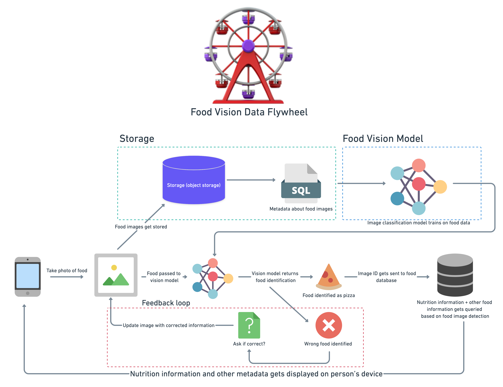
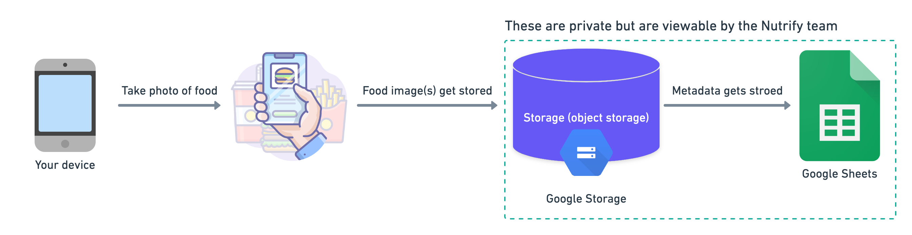

# Nutrify - take a photo of food and learn about it

**Note:** Nutrify is a work in progress. Expect plenty of errors and bugs.

## Updates

* **18 Jan 2023** - Wrote a [blog post](https://www.mrdbourke.com/copying-teslas-data-engine-for-food-images) and made a [YouTube video](https://youtu.be/02b-1spzLzc) about Nutrify's data engine (the driving force behind making the FoodVision model better)

[Sign up](https://forms.gle/8ye134pvgEKWJQHd6) for email updates.

## What's the goal?

To build a [Pokédex for food](https://nutrifyaigrantapplication.com/)!

To do so, we're going to need lots of food images...

You can start uploading/labelling your food images via Nutrify's [Food Image Collector app](https://mrdbourke-nutrify-food-image-collector-oze8yr.streamlit.app/).

Streaming progress on [Twitch](https://www.twitch.tv/mrdbourke)/making videos about it on YouTube.

**End goal:** take a photo of food an learn about it (nutrition information, where it's from, recipes, etc).

Something like this (a data flywheel/engine for food images):

**Status:** making a small application to collect large amounts of food images.

## What's in this repo?
TODO: document this better (will likely do a big refactor once the data engine for classification is fleshed out)

* `images/` - folder with misc images for the project
* `data_exploration/` - notebooks & data exploring the USDA FoodData Central data (this has info about the nutrition content of foods)
* `food_image_collector.py` - Streamlit-powered app that collects photos and uploads them to a Google Storage bucket and stores metadata in Google Sheets (these are private), see the workflow below.
* `save_to_gsheets.py` - Small utility script that saves a bunch of metadata about an uploaded image to a Google Sheet (this will likely move into a dedicated `utils/` folder later on.
* `utils.py` - Series of helper functions used in `food_image_collector.py`, for example, `upload_blod()`, a function that uploads a photo to Google Storage.
* `requirements.txt` - A text file with the dependency requirements for this project.

## Image uploading workflow

The script `food_image_collector.py` is currently hosted using Streamlit Cloud. It does this:

## Master plan

As of: 15 March 2022

**Note:** this is very likely to change.

### Stage 1 (done)

Build food image collection app, need a way to store images at large scale, images: object storage (Google Storage), info about images: relational database (PostgreSQL).

### Stage 2 (done, see: https://github.com/mrdbourke/nutrify/releases/tag/v0.1.3)

Build small prototype computer vision app to take a photo of ~100 different types of foods and return back their nutrition information (this'll be done via a public nutrition API, if you know of one, please let me know).

### Stage 3 (up to here)

Merge inputs to stage 1 and stage 2 into a database (start linking together the data flywheel, more images get taken, models get improved, more images, better models, more images, better models, etc).

### Stage 4

Upgrade stage 1, 2, 3 to work with world's 100 most commonly eaten foods (start with top of the Pareto curve and then start working backwards towards the tail).

### Stage 5

Repeat the above until almost every food you can eat is covered.

## Log
* 18 Jan 2022 - Nutrify iOS app well on the way, data engine for image classification well under way, full code coming soon
* 14 Mar 2022 - added macronutrient details for ~100 foods, [see release notes](https://github.com/mrdbourke/nutrify/releases/tag/v0.1.3)
* 17 Jan 2022 - cleaned up the data by removing duplicates/fixing some low performing classes ([see the update comment](https://github.com/mrdbourke/nutrify/discussions/32#discussioncomment-1980942))
* 14 Jan 2022 - Nutrify can now identify 100 foods ([see release notes](https://github.com/mrdbourke/nutrify/releases/tag/v0.1.2))
* 22 Dec 2021 - Nutrify can now identify 78 foods
